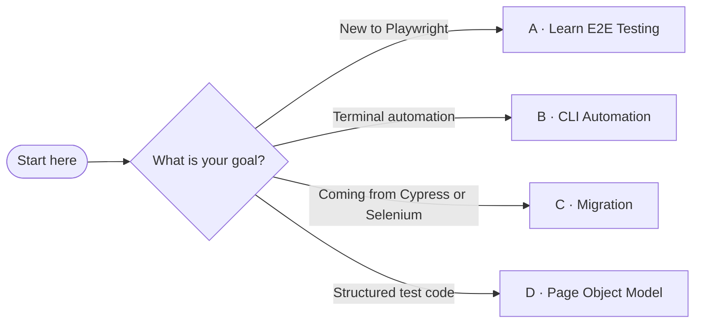

<!-- Playwright Skill by TestDino -->

<div align="center">
  <h1>Playwright Skill</h1>
  <p>Production-tested guides that help AI coding agents generate better Playwright tests.</p>
</div>

<div align="center">
  <a href="https://github.com/testdino-hq/playwright-skill/stargazers">
    
  </a>
  <a href="LICENSE">
    
  </a>
  
  
  
</div>

---

Give your AI agent — Cursor, Claude, GitHub Copilot, Windsurf, or any AI coding tool — the knowledge to write reliable, maintainable Playwright tests on the first try. These aren't generic docs. They're battle-tested patterns used every day at [TestDino](https://testdino.com) to generate E2E tests for real-world applications.

> **70+ guides** covering E2E, API, component, visual, accessibility, and security testing, plus CI/CD and CLI automation — with TypeScript and JavaScript examples throughout.

---

## Table of Contents

- [Who Is This For?](#who-is-this-for)
- [Why These Skills?](#why-these-skills)
- [Quick Start](#quick-start)
- [What's Inside](#whats-inside)
- [Core Skills](#core-skills)
- [CI/CD Skills](#cicd-skills)
- [Playwright CLI Skills](#playwright-cli-skills)
- [Migration Skills](#migration-skills)
- [Page Object Model Skills](#page-object-model-skills)
- [Contributing](#contributing)
- [License](#license)

---

## Who Is This For?

- **Developers using AI coding agents** who want better Playwright test generation out of the box
- **QA engineers** looking for a comprehensive, well-organized Playwright reference
- **Teams migrating** from Cypress or Selenium to Playwright
- **Anyone tired of AI-generated tests** that break on the first run

---

## Why These Skills?

AI agents generate Playwright tests that _look_ right but fail in CI. Wrong selectors, missing waits, no auth handling, flaky assertions — the same problems, over and over.

These guides document every pattern that actually works in production. No guesswork, no boilerplate — just the decisions that matter: which locator to use, when to mock, how to handle auth, why your test is flaky.

They're used internally at [TestDino](https://testdino.com) to generate E2E tests for real applications. The guides encode that hard-won knowledge so your AI agent gets it right on the first try.

---

## Quick Start

The `skills` CLI copies guide content into your project so AI coding agents like Cursor, Claude, and Copilot can reference these patterns when generating tests.

Add all skill packs to your project at once:

```bash
npx skills add testdino-hq/playwright-skill
```

Or install only the packs you need:

```bash
npx skills add testdino-hq/playwright-skill/core          # Locators, assertions, fixtures, auth, API testing, and more
npx skills add testdino-hq/playwright-skill/ci             # GitHub Actions, GitLab CI, Docker, sharding
npx skills add testdino-hq/playwright-skill/pom            # Page Object Model patterns
npx skills add testdino-hq/playwright-skill/migration      # Migrate from Cypress or Selenium
npx skills add testdino-hq/playwright-skill/playwright-cli # CLI browser automation
```

---

## What's Inside

| Skill Pack | Guides | What's Covered |
| --- | :---: | --- |
| **[core](#core-skills)** | 46 | Locators, assertions, fixtures, auth, API testing, network mocking, visual regression, accessibility, debugging, framework recipes |
| **[ci](#cicd-skills)** | 9 | GitHub Actions, GitLab CI, CircleCI, Azure DevOps, Jenkins, Docker, sharding, reporting, coverage |
| **[pom](#page-object-model-skills)** | 2 | Page Object Model patterns, POM vs fixtures vs helpers |
| **[migration](#migration-skills)** | 2 | Migrating from Cypress, migrating from Selenium |
| **[playwright-cli](#playwright-cli-skills)** | 11 | CLI browser automation, screenshots, tracing, session management, device emulation |

---

## Core Skills

The foundation of Playwright testing. Start here if you're new to Playwright, or use these as a reference when your AI agent needs to handle a specific pattern.

> **New to Playwright?** Follow this path:
> [locators.md](core/locators.md) → [assertions-and-waiting.md](core/assertions-and-waiting.md) → [fixtures-and-hooks.md](core/fixtures-and-hooks.md)

### Writing Tests

| Guide | Description |
| --- | --- |
| [locators.md](core/locators.md) | Selector strategies — `getByRole`, `getByText`, `getByTestId` |
| [assertions-and-waiting.md](core/assertions-and-waiting.md) | Web-first assertions, auto-retry, waiting patterns |
| [fixtures-and-hooks.md](core/fixtures-and-hooks.md) | `test.extend()`, setup/teardown, worker-scoped fixtures |
| [configuration.md](core/configuration.md) | `playwright.config.ts` — projects, timeouts, reporters, web server |
| [test-organization.md](core/test-organization.md) | File structure, tagging, `test.describe`, test filtering |
| [test-data-management.md](core/test-data-management.md) | Factories, seeding, cleanup strategies |
| [authentication.md](core/authentication.md) | Storage state reuse, multi-role auth, session management |
| [auth-flows.md](core/auth-flows.md) | Login, signup, logout, OAuth, and SSO flow recipes |
| [api-testing.md](core/api-testing.md) | REST and GraphQL testing with the `request` fixture |
| [network-mocking.md](core/network-mocking.md) | Route interception, HAR replay, response modification |
| [when-to-mock.md](core/when-to-mock.md) | Mock third-party boundaries, never your own app |
| [forms-and-validation.md](core/forms-and-validation.md) | Form fills, validation, error states, multi-step wizards |
| [visual-regression.md](core/visual-regression.md) | Screenshot comparison, thresholds, masking dynamic content |
| [accessibility.md](core/accessibility.md) | axe-core integration, ARIA assertions, a11y auditing |
| [component-testing.md](core/component-testing.md) | Mount React/Vue/Svelte components in isolation |
| [mobile-and-responsive.md](core/mobile-and-responsive.md) | Device emulation, viewport testing, touch interactions |
| [file-operations.md](core/file-operations.md) | File uploads, downloads, drag-and-drop file interactions |
| [file-upload-download.md](core/file-upload-download.md) | Upload and download recipes — single, multiple, progress |
| [error-and-edge-cases.md](core/error-and-edge-cases.md) | Error states, boundary conditions, unhappy path testing |
| [crud-testing.md](core/crud-testing.md) | Create, read, update, delete test patterns for any resource |
| [drag-and-drop.md](core/drag-and-drop.md) | Sortable lists, kanban boards, file drop zones |
| [search-and-filter.md](core/search-and-filter.md) | Search inputs, filters, autocomplete, no-results states |

### Debugging & Fixing

| Guide | Description |
| --- | --- |
| [debugging.md](core/debugging.md) | Trace viewer, `PWDEBUG`, UI mode, headed + slow-mo |
| [error-index.md](core/error-index.md) | Common error messages and how to fix them |
| [flaky-tests.md](core/flaky-tests.md) | Root causes, retry strategies, stabilization patterns |
| [common-pitfalls.md](core/common-pitfalls.md) | Top beginner mistakes and how to avoid them |

### Framework Recipes

| Guide | Description |
| --- | --- |
| [nextjs.md](core/nextjs.md) | App Router + Pages Router testing |
| [react.md](core/react.md) | CRA, Vite, component testing |
| [vue.md](core/vue.md) | Vue 3 / Nuxt testing |
| [angular.md](core/angular.md) | Angular testing patterns |

### Specialized Topics

| Guide | Description |
| --- | --- |
| [browser-apis.md](core/browser-apis.md) | Geolocation, clipboard, permissions |
| [iframes-and-shadow-dom.md](core/iframes-and-shadow-dom.md) | Cross-frame testing, Shadow DOM piercing |
| [multi-context-and-popups.md](core/multi-context-and-popups.md) | Multi-tab, popups, new windows |
| [websockets-and-realtime.md](core/websockets-and-realtime.md) | WebSocket testing, real-time UI |
| [canvas-and-webgl.md](core/canvas-and-webgl.md) | Canvas testing, visual comparison |
| [electron-testing.md](core/electron-testing.md) | Desktop app testing with Electron |
| [security-testing.md](core/security-testing.md) | XSS, CSRF, header validation |
| [performance-testing.md](core/performance-testing.md) | Core Web Vitals, Lighthouse, benchmarks |
| [clock-and-time-mocking.md](core/clock-and-time-mocking.md) | Fake timers, date mocking |
| [service-workers-and-pwa.md](core/service-workers-and-pwa.md) | PWA testing, offline mode |
| [browser-extensions.md](core/browser-extensions.md) | Extension testing patterns |
| [i18n-and-localization.md](core/i18n-and-localization.md) | Multi-language, RTL, locale testing |
| [multi-user-and-collaboration.md](core/multi-user-and-collaboration.md) | Real-time collaboration, multi-user workflows, shared state |
| [third-party-integrations.md](core/third-party-integrations.md) | OAuth providers, payment gateways, analytics, CAPTCHAs |

### Architecture Decisions

Not sure which approach to take? These guides answer the "which option?" questions before you write a line of code.

| Question | Guide |
| --- | --- |
| Which locator strategy should I use? | [locator-strategy.md](core/locator-strategy.md) |
| E2E vs component vs API — what kind of test? | [test-architecture.md](core/test-architecture.md) |
| Should I mock this service or hit it for real? | [when-to-mock.md](core/when-to-mock.md) |
| POM vs fixtures vs helpers — what's right here? | [pom-vs-fixtures-vs-helpers.md](pom/pom-vs-fixtures-vs-helpers.md) |

---

## CI/CD Skills

| Guide | Description |
| --- | --- |
| [ci-github-actions.md](ci/ci-github-actions.md) | Workflows, caching, artifact uploads |
| [ci-gitlab.md](ci/ci-gitlab.md) | GitLab CI pipelines |
| [ci-other.md](ci/ci-other.md) | CircleCI, Azure DevOps, Jenkins |
| [parallel-and-sharding.md](ci/parallel-and-sharding.md) | Sharding across CI runners |
| [docker-and-containers.md](ci/docker-and-containers.md) | Containerized test execution |
| [reporting-and-artifacts.md](ci/reporting-and-artifacts.md) | HTML reports, traces, screenshots |
| [test-coverage.md](ci/test-coverage.md) | Code coverage collection |
| [global-setup-teardown.md](ci/global-setup-teardown.md) | One-time setup/teardown |
| [projects-and-dependencies.md](ci/projects-and-dependencies.md) | Multi-project config, dependencies |

---

## Playwright CLI Skills

| Guide | Description |
| --- | --- |
| [SKILL.md](playwright-cli/SKILL.md) | CLI overview — when and how to use browser automation from the CLI |
| [core-commands.md](playwright-cli/core-commands.md) | Open, navigate, click, fill, keyboard, mouse |
| [request-mocking.md](playwright-cli/request-mocking.md) | Route interception, conditional mocks, HAR replay |
| [running-custom-code.md](playwright-cli/running-custom-code.md) | Full Playwright API via `run-code` |
| [session-management.md](playwright-cli/session-management.md) | Named sessions, isolation, persistent profiles |
| [storage-and-auth.md](playwright-cli/storage-and-auth.md) | Cookies, localStorage, auth state save/restore |
| [test-generation.md](playwright-cli/test-generation.md) | Auto-generate test code from CLI interactions |
| [tracing-and-debugging.md](playwright-cli/tracing-and-debugging.md) | Traces, console/network monitoring |
| [screenshots-and-media.md](playwright-cli/screenshots-and-media.md) | Screenshots, video recording, PDF export |
| [device-emulation.md](playwright-cli/device-emulation.md) | Viewport, geolocation, locale, dark mode |
| [advanced-workflows.md](playwright-cli/advanced-workflows.md) | Popups, scraping, accessibility auditing |

---

## Migration Skills

| Guide | Description |
| --- | --- |
| [from-cypress.md](migration/from-cypress.md) | Cypress to Playwright — API mapping, config translation, common gotchas |
| [from-selenium.md](migration/from-selenium.md) | Selenium/WebDriver to Playwright — locator strategies, wait model, parallel execution |

---

## Page Object Model Skills

| Guide | Description |
| --- | --- |
| [page-object-model.md](pom/page-object-model.md) | POM patterns for Playwright |
| [pom-vs-fixtures-vs-helpers.md](pom/pom-vs-fixtures-vs-helpers.md) | When to use POM vs fixtures vs helpers |

---

## Beginner Guide

Not sure where to start? Pick your goal and follow the path.



---

### Path A · Learn Playwright Testing *(recommended for beginners)*

```bash
npx skills add testdino-hq/playwright-skill/core
```

**Read these four guides first, in order:**

1. [locators.md](core/locators.md) — how to find elements on the page
2. [assertions-and-waiting.md](core/assertions-and-waiting.md) — how to verify and wait correctly
3. [fixtures-and-hooks.md](core/fixtures-and-hooks.md) — how to share setup across tests
4. [configuration.md](core/configuration.md) — how to configure Playwright for your project

**Then add only what your app needs:**

| Your app has... | Read this |
| --- | --- |
| Login or auth | [authentication.md](core/authentication.md) · [auth-flows.md](core/auth-flows.md) |
| Forms | [forms-and-validation.md](core/forms-and-validation.md) |
| API calls | [api-testing.md](core/api-testing.md) |
| Network mocking | [when-to-mock.md](core/when-to-mock.md) · [network-mocking.md](core/network-mocking.md) |
| Visual checks | [visual-regression.md](core/visual-regression.md) |
| Accessibility | [accessibility.md](core/accessibility.md) |
| CRUD screens | [crud-testing.md](core/crud-testing.md) |
| Search or filters | [search-and-filter.md](core/search-and-filter.md) |
| File upload/download | [file-operations.md](core/file-operations.md) · [file-upload-download.md](core/file-upload-download.md) |
| Test data setup | [test-data-management.md](core/test-data-management.md) |

**When something breaks:**

[debugging.md](core/debugging.md) → [error-index.md](core/error-index.md) → [common-pitfalls.md](core/common-pitfalls.md) → [flaky-tests.md](core/flaky-tests.md)

**When you're ready to scale:**

[test-architecture.md](core/test-architecture.md) · [locator-strategy.md](core/locator-strategy.md) · [pom-vs-fixtures-vs-helpers.md](pom/pom-vs-fixtures-vs-helpers.md)

**When local tests are stable, move to CI:**

```bash
npx skills add testdino-hq/playwright-skill/ci
```

1. [ci-github-actions.md](ci/ci-github-actions.md) or [ci-gitlab.md](ci/ci-gitlab.md) — pick your platform
2. [reporting-and-artifacts.md](ci/reporting-and-artifacts.md) — HTML reports and traces
3. [parallel-and-sharding.md](ci/parallel-and-sharding.md) — speed up your pipeline
4. [docker-and-containers.md](ci/docker-and-containers.md) *(only if using Docker)*
5. [test-coverage.md](ci/test-coverage.md) *(only if you need coverage)*

**Advanced — only when your app requires it:**

[iframes-and-shadow-dom.md](core/iframes-and-shadow-dom.md) · [multi-context-and-popups.md](core/multi-context-and-popups.md) · [websockets-and-realtime.md](core/websockets-and-realtime.md) · [service-workers-and-pwa.md](core/service-workers-and-pwa.md) · [i18n-and-localization.md](core/i18n-and-localization.md) · [third-party-integrations.md](core/third-party-integrations.md) · [security-testing.md](core/security-testing.md) · [performance-testing.md](core/performance-testing.md)

---

### Path B · CLI Browser Automation

```bash
npx skills add testdino-hq/playwright-skill/playwright-cli
```

1. [SKILL.md](playwright-cli/SKILL.md) — start here for an overview
2. [core-commands.md](playwright-cli/core-commands.md)
3. [session-management.md](playwright-cli/session-management.md)
4. [storage-and-auth.md](playwright-cli/storage-and-auth.md)
5. [tracing-and-debugging.md](playwright-cli/tracing-and-debugging.md)
6. [screenshots-and-media.md](playwright-cli/screenshots-and-media.md)

---

### Path C · Migrating from Another Tool

```bash
npx skills add testdino-hq/playwright-skill/migration
```

| Coming from | Read this |
| --- | --- |
| Cypress | [from-cypress.md](migration/from-cypress.md) — API mapping, config translation, common gotchas |
| Selenium / WebDriver | [from-selenium.md](migration/from-selenium.md) — locator strategies, wait model, parallel execution |

---

### Path D · Page Object Model Structure

```bash
npx skills add testdino-hq/playwright-skill/pom
```

1. [page-object-model.md](pom/page-object-model.md) — POM patterns for Playwright
2. [pom-vs-fixtures-vs-helpers.md](pom/pom-vs-fixtures-vs-helpers.md) — when to use each approach


## Contributing

Found a bug or a missing pattern? [Open an issue](https://github.com/testdino-hq/playwright-skill/issues) or submit a PR.

---

## License

[MIT](LICENSE)

---

<div align="center">
  Built by <a href="https://testdino.com">TestDino</a> — production Playwright test generation
</div>
